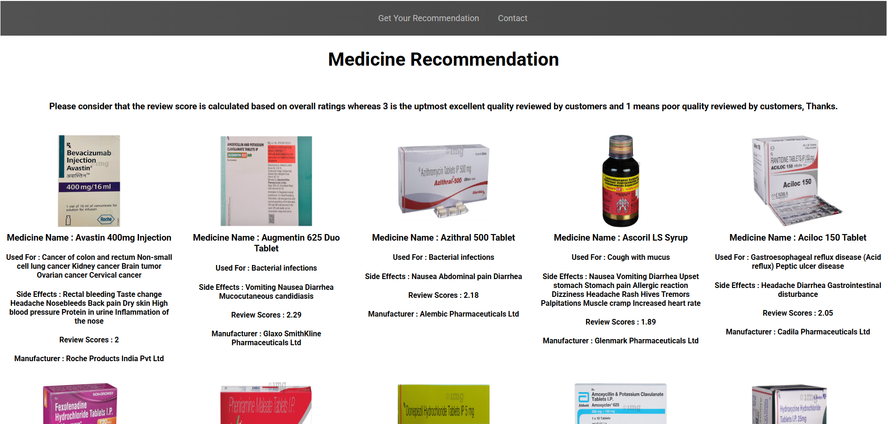
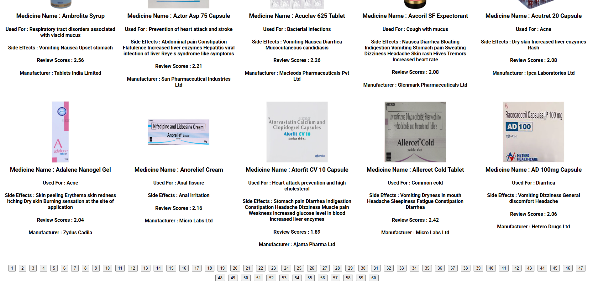

<h1> Medicine Recommendation System </h1>

# Overview 
The Medicine Recommendation System Project is designed to recommend assist users in finding suitable medicines based on their needs. The system leverages **Natural Language Processing (NLP)** techniques such as **TF-IDF and Cosine Similarity** to provide intelligent recommendations. Additionally, it incorporates custom-generated review weightages to prioritize recommendations based on products reviews. The system offers two key recommendation features:

**1. Product Uses Similarity-Based Recommendations** : Provides medicine recommendations based on product uses similarity.

**2. Side Effects and Medicine Similarity-Based Recommendations** : Offers recommendations by considering both medicine uses similarity and the similarity between side effects of the medicines.

The system leverages a machine learning model exported using a pickle file and uses Flask to host the webpages and includes a user-friendly interface with three main pages: Home , Recommendation , and Contact .

# Features
**1. Product Uses Similarity-Based Recommendations**:
* This feature recommends medicines based on their similarity to the user's input.
Ideal for users looking for alternatives to a specific medicine.

**2. Side Effects and Medicine Similarity-Based Recommendations**:
* This advanced feature considers not only the similarity between medicines but also the similarity between their side effects.
Ensures that the recommended medicines are not only similar in Uses but also similar in terms of potential side effects.

**3. NLP-Based Recommendations with Custom Review Weightages**:
- * The system uses TF-IDF to transform textual data into numerical vectors.
Cosine Similarity is then applied to compute the similarity between the user's query and the dataset entries.
A custom review weightage method is implemented to prioritize recommendations based on products reviews. Higher-rated medicines are ranked higher in recommendations.
This ensures that the recommendations are not only technically accurate but also aligned with real-world user experiences.

# Additional Features
## Data Logging
The system logs user search inputs and recommended medicines into a CSV file. The CSV file contains the following columns:
- `user_input`: The input provided by the user.
- `suggested_names`: The recommended medicines generated by the model.
- `results`: A dictionary containing detailed information about each recommended medicine.
- `timestamp`: The date and time of the search.
## Components
Flask Web Interface : The system provides a clean and intuitive web interface with the following pages:
- **Home Page**: It contains all the list of medicines which one can view and understand its different uses. 
- **Recommendation Page**: Allows users to search for medicines and view recommendations.
- **Contact Page**: Provides contact information.

# Installation and Setup
## Prerequisites
1. Python
2. Flask
3. Pickle
4. Pandas
5. Matplotlib
6. Scikit-learn
7. numpy
8. csv

# Images

## HomePage Header:

## HomePage Footer:

## Recommendation Page:

## Medicine Uses Recommendations:

## Medicine Uses And Side Effect Recommendations:

## Contact:

# License
This project is licensed under the MIT License. 

# Contributions
Please Feel free to contribute to this project by submitting issues or pull requests.

Any enhancements, bug fixes, or optimizations are extremely welcomed!

